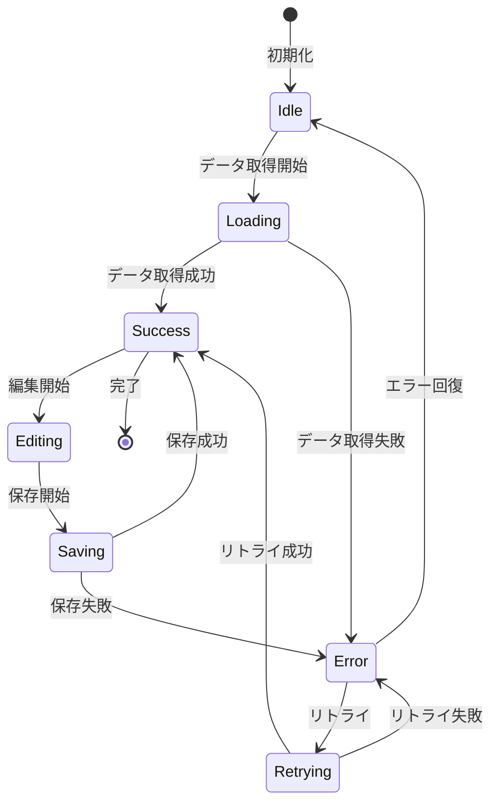

# エラーハンドリングと状態管理

## 概要

実績日報入力システムの状態管理とエラーハンドリングは、ユーザーの操作を安全かつ予測可能な形で処理することを目的としています。React Context APIとカスタムフックを組み合わせ、複雑な状態遷移を管理します。

## 状態管理アーキテクチャ

### Context層の構造

```
AchievementRecordProvider
├── ApiProvider (データ取得・永続化)
├── SelectionProvider (UI選択状態)
├── DataProvider (フォーム・作業データ)
└── ErrorProvider (エラーハンドリング)
```

### 状態の分類

#### 1. グローバル状態 (Context管理)

```typescript
interface GlobalState {
  // データ状態
  workEntries: WorkEntry[]
  categories: WorkCategory[]
  isLoading: boolean

  // UI状態
  selectedDate: Date | null
  selectedWorkId: string | null
  viewMode: CalendarViewMode
  formMode: 'create' | 'edit' | 'view'

  // エラー状態
  errors: AppError[]
  lastError: AppError | null
}
```

#### 2. ローカル状態 (コンポーネント管理)

```typescript
interface ComponentState {
  // フォーム状態
  formData: WorkEntryFormData
  formErrors: FormValidationErrors
  isSubmitting: boolean
  isDirty: boolean

  // UI状態
  isExpanded: boolean
  searchQuery: string
  sortBy: SortField
  sortOrder: SortDirection
}
```

## 状態管理フロー

### データフロー図

```
┌─────────────┐    ┌─────────────┐    ┌─────────────┐
│  ユーザー操作 │ -> │ UIコンポーネント │ -> │    アクション   │
└─────────────┘    └─────────────┘    └─────────────┘
       ↑                                                │
       │                                                ↓
┌─────────────┐    ┌─────────────┐    ┌─────────────┐
│  状態更新     │ <- │    フック     │ <- │   Context     │
└─────────────┘    └─────────────┘    └─────────────┘
       ↑                                                │
       │                                                ↓
┌─────────────┐    ┌─────────────┐    ┌─────────────┐
│   レンダリング │ <- │   セレクター  │ <- │   API呼び出し │
└─────────────┘    └─────────────┘    └─────────────┘
```

### 状態遷移図



## エラーハンドリング戦略

### エラーの分類

#### 1. APIエラー

```typescript
enum ApiErrorType {
  NETWORK_ERROR = 'NETWORK_ERROR',           // ネットワーク接続エラー
  SERVER_ERROR = 'SERVER_ERROR',             // サーバー内部エラー (5xx)
  CLIENT_ERROR = 'CLIENT_ERROR',             // クライアントエラー (4xx)
  AUTHENTICATION_ERROR = 'AUTHENTICATION_ERROR', // 認証エラー
  AUTHORIZATION_ERROR = 'AUTHORIZATION_ERROR',   // 権限エラー
  VALIDATION_ERROR = 'VALIDATION_ERROR',     // バリデーションエラー
  RATE_LIMIT_ERROR = 'RATE_LIMIT_ERROR',     // レート制限エラー
  TIMEOUT_ERROR = 'TIMEOUT_ERROR'            // タイムアウトエラー
}

interface ApiError {
  type: ApiErrorType
  message: string
  statusCode?: number
  details?: Record<string, any>
  timestamp: Date
  retryable: boolean
}
```

#### 2. UIエラー

```typescript
enum UiErrorType {
  VALIDATION_ERROR = 'VALIDATION_ERROR',     // フォームバリデーションエラー
  REQUIRED_FIELD_ERROR = 'REQUIRED_FIELD_ERROR', // 必須フィールド未入力
  FORMAT_ERROR = 'FORMAT_ERROR',             // データ形式エラー
  PERMISSION_ERROR = 'PERMISSION_ERROR',     // UI権限エラー
  STATE_ERROR = 'STATE_ERROR'                // 不正な状態遷移
}

interface UiError {
  type: UiErrorType
  field?: string
  message: string
  timestamp: Date
}
```

#### 3. システムエラー

```typescript
enum SystemErrorType {
  CONTEXT_ERROR = 'CONTEXT_ERROR',           // Context未設定エラー
  MEMORY_ERROR = 'MEMORY_ERROR',             // メモリ不足エラー
  STORAGE_ERROR = 'STORAGE_ERROR',           // ストレージエラー
  BROWSER_ERROR = 'BROWSER_ERROR'            // ブラウザ互換性エラー
}
```

### エラーハンドリングフック

#### useErrorHandler

```typescript
interface UseErrorHandlerReturn {
  handleError: (error: unknown) => void
  clearError: (errorId?: string) => void
  errors: AppError[]
  hasErrors: boolean
}

const useErrorHandler = (): UseErrorHandlerReturn => {
  const [errors, setErrors] = useState<AppError[]>([])
  const { addNotification } = useNotification()

  const handleError = useCallback((error: unknown) => {
    const appError = normalizeError(error)

    setErrors(prev => [...prev, appError])

    // ユーザー通知
    addNotification({
      type: 'error',
      title: getErrorTitle(appError),
      message: appError.message,
      action: appError.retryable ? {
        label: '再試行',
        onClick: () => retryOperation(appError)
      } : undefined
    })

    // エラーログ
    logError(appError)

    // モニタリング
    trackError(appError)
  }, [addNotification])

  const clearError = useCallback((errorId?: string) => {
    if (errorId) {
      setErrors(prev => prev.filter(e => e.id !== errorId))
    } else {
      setErrors([])
    }
  }, [])

  return {
    handleError,
    clearError,
    errors,
    hasErrors: errors.length > 0
  }
}
```

#### useAsyncOperation

```typescript
interface UseAsyncOperationReturn<T> {
  execute: (...args: any[]) => Promise<T>
  data: T | null
  error: AppError | null
  isLoading: boolean
  reset: () => void
}

const useAsyncOperation = <T,>(
  operation: (...args: any[]) => Promise<T>,
  options: {
    onSuccess?: (data: T) => void
    onError?: (error: AppError) => void
    retries?: number
    retryDelay?: number
  } = {}
): UseAsyncOperationReturn<T> => {
  const [data, setData] = useState<T | null>(null)
  const [error, setError] = useState<AppError | null>(null)
  const [isLoading, setIsLoading] = useState(false)

  const execute = useCallback(async (...args: any[]) => {
    setIsLoading(true)
    setError(null)

    try {
      const result = await retryAsync(
        () => operation(...args),
        options.retries || 0,
        options.retryDelay || 1000
      )

      setData(result)
      options.onSuccess?.(result)
      return result
    } catch (err) {
      const appError = normalizeError(err)
      setError(appError)
      options.onError?.(appError)
      throw appError
    } finally {
      setIsLoading(false)
    }
  }, [operation, options])

  const reset = useCallback(() => {
    setData(null)
    setError(null)
    setIsLoading(false)
  }, [])

  return { execute, data, error, isLoading, reset }
}
```

### 回復戦略

#### リトライ機構

```typescript
// 指数バックオフ付きリトライ
const retryAsync = async <T>(
  operation: () => Promise<T>,
  maxRetries: number,
  baseDelay: number
): Promise<T> => {
  let lastError: Error

  for (let attempt = 0; attempt <= maxRetries; attempt++) {
    try {
      return await operation()
    } catch (error) {
      lastError = error as Error

      if (attempt < maxRetries && isRetryableError(error)) {
        const delay = baseDelay * Math.pow(2, attempt) + Math.random() * 1000
        await new Promise(resolve => setTimeout(resolve, delay))
        continue
      }

      throw error
    }
  }

  throw lastError!
}

// リトライ可能エラーの判定
const isRetryableError = (error: unknown): boolean => {
  if (error instanceof ApiError) {
    return [
      ApiErrorType.NETWORK_ERROR,
      ApiErrorType.TIMEOUT_ERROR,
      ApiErrorType.SERVER_ERROR
    ].includes(error.type)
  }

  return error instanceof NetworkError || error instanceof TimeoutError
}
```

#### フォールバックUI

```typescript
// エラー境界コンポーネント
class ErrorBoundary extends Component<ErrorBoundaryProps, ErrorBoundaryState> {
  constructor(props: ErrorBoundaryProps) {
    super(props)
    this.state = { hasError: false, error: null }
  }

  static getDerivedStateFromError(error: Error): ErrorBoundaryState {
    return { hasError: true, error }
  }

  componentDidCatch(error: Error, errorInfo: ErrorInfo) {
    logError(error, errorInfo)
  }

  render() {
    if (this.state.hasError) {
      return (
        <ErrorFallback
          error={this.state.error}
          onRetry={() => {
            this.setState({ hasError: false, error: null })
          }}
          onReport={() => reportError(this.state.error)}
        />
      )
    }

    return this.props.children
  }
}

// フォールバックUI
const ErrorFallback = ({ error, onRetry, onReport }: ErrorFallbackProps) => {
  return (
    <div role="alert" className="error-fallback">
      <h2>エラーが発生しました</h2>
      <p>申し訳ありませんが、一時的な問題が発生しました。</p>

      <div className="error-actions">
        <button onClick={onRetry} className="retry-button">
          再試行
        </button>
        <button onClick={onReport} className="report-button">
          問題を報告
        </button>
      </div>

      {process.env.NODE_ENV === 'development' && (
        <details className="error-details">
          <summary>詳細情報（開発者向け）</summary>
          <pre>{error?.stack}</pre>
        </details>
      )}
    </div>
  )
}
```

### エラーメッセージ管理

#### ユーザーフレンドリーなメッセージ

```typescript
const ERROR_MESSAGES = {
  [ApiErrorType.NETWORK_ERROR]: {
    title: 'ネットワークエラー',
    message: 'インターネット接続を確認してください。',
    action: '再接続'
  },
  [ApiErrorType.VALIDATION_ERROR]: {
    title: '入力エラー',
    message: '入力内容を確認してください。',
    action: '修正'
  },
  [ApiErrorType.AUTHENTICATION_ERROR]: {
    title: '認証エラー',
    message: '再度ログインしてください。',
    action: 'ログイン'
  }
} as const

const getUserFriendlyMessage = (error: AppError) => {
  const config = ERROR_MESSAGES[error.type] || {
    title: 'エラー',
    message: '予期しないエラーが発生しました。',
    action: '再試行'
  }

  return {
    ...config,
    details: error.message,
    retryable: error.retryable
  }
}
```

## 状態の永続化

### ローカルストレージ

```typescript
// フォームデータの永続化
const useFormPersistence = (formId: string) => {
  const [persistedData, setPersistedData] = useState<WorkEntryFormData | null>(null)

  useEffect(() => {
    try {
      const stored = localStorage.getItem(`form-${formId}`)
      if (stored) {
        const parsed = JSON.parse(stored)
        // 有効期限チェック（24時間）
        if (Date.now() - parsed.timestamp < 24 * 60 * 60 * 1000) {
          setPersistedData(parsed.data)
        } else {
          localStorage.removeItem(`form-${formId}`)
        }
      }
    } catch (error) {
      console.warn('Failed to load persisted form data:', error)
    }
  }, [formId])

  const persistData = useCallback((data: WorkEntryFormData) => {
    try {
      localStorage.setItem(`form-${formId}`, JSON.stringify({
        data,
        timestamp: Date.now()
      }))
    } catch (error) {
      console.warn('Failed to persist form data:', error)
    }
  }, [formId])

  const clearPersistedData = useCallback(() => {
    localStorage.removeItem(`form-${formId}`)
  }, [formId])

  return { persistedData, persistData, clearPersistedData }
}
```

### URL状態管理

```typescript
// URLパラメータとの同期
const useUrlState = <T>(
  key: string,
  defaultValue: T,
  serialize: (value: T) => string,
  deserialize: (value: string) => T
) => {
  const [value, setValue] = useState<T>(() => {
    const urlParams = new URLSearchParams(window.location.search)
    const paramValue = urlParams.get(key)
    return paramValue ? deserialize(paramValue) : defaultValue
  })

  const updateValue = useCallback((newValue: T) => {
    setValue(newValue)

    // URL更新
    const url = new URL(window.location.href)
    if (newValue === defaultValue) {
      url.searchParams.delete(key)
    } else {
      url.searchParams.set(key, serialize(newValue))
    }

    window.history.replaceState({}, '', url.toString())
  }, [key, defaultValue, serialize, deserialize])

  return [value, updateValue] as const
}
```

## デバッグと監視

### 開発者ツール

```typescript
// 状態デバッガー
const useStateDebugger = (state: any, label: string) => {
  useEffect(() => {
    if (process.env.NODE_ENV === 'development') {
      console.group(`🔍 ${label}`)
      console.log('State:', state)
      console.log('Timestamp:', new Date().toISOString())
      console.groupEnd()
    }
  }, [state, label])
}

// エラーロガー
const errorLogger = {
  log: (error: AppError, context?: Record<string, any>) => {
    const logEntry = {
      timestamp: new Date().toISOString(),
      error,
      context,
      userAgent: navigator.userAgent,
      url: window.location.href
    }

    // 開発環境ではコンソール出力
    if (process.env.NODE_ENV === 'development') {
      console.error('🚨 App Error:', logEntry)
    }

    // 本番環境では監視サービスに送信
    if (process.env.NODE_ENV === 'production') {
      // Sentry, LogRocket, etc.
      monitoringService.captureException(error, { extra: logEntry })
    }
  }
}
```

このエラーハンドリングと状態管理戦略により、堅牢でユーザーフレンドリーなアプリケーションを実現します。
